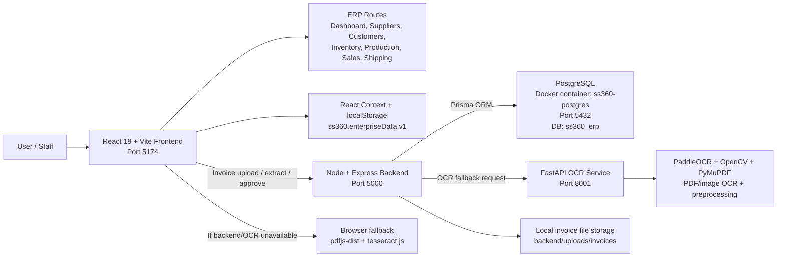
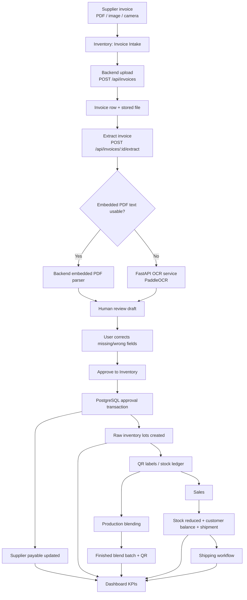
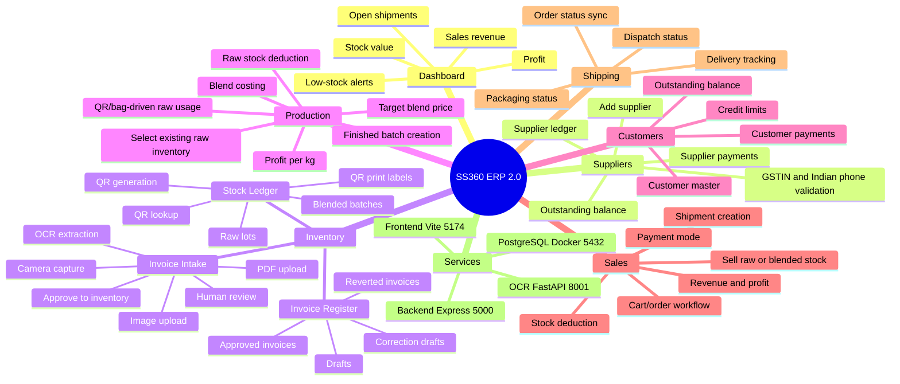
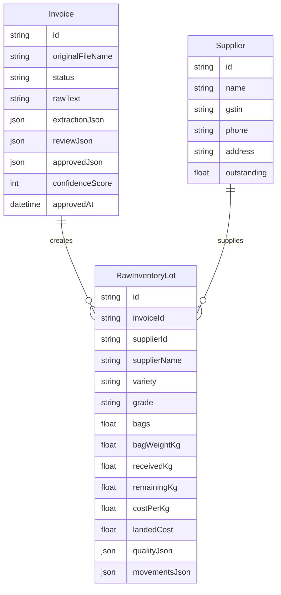

# SS360 ERP 2.0 Project Diagrams

This document captures the high-level SS360 ERP architecture, runtime services, feature map, invoice-to-inventory workflow, and core persisted data model.

## Service Architecture

## Invoice To Inventory Workflow

## High-Level Feature Map

## Core Data Model

## Runtime Services

| Service     |   Port | Purpose                                    | Start Path                                  |
| ----------- | -----: | ------------------------------------------ | ------------------------------------------- |
| Frontend    | `5174` | React ERP UI and routes                    | `npm run dev:local` or `Start-SS360.cmd`    |
| Backend API | `5000` | Invoice upload, extraction, approval API   | `backend/npm run start` via launcher        |
| OCR service | `8001` | Local PDF/image OCR using PaddleOCR        | `uvicorn main:app --port 8001` via launcher |
| PostgreSQL  | `5432` | Persistent invoice, supplier, raw lot data | Docker container `ss360-postgres`           |

## Summary

SS360 ERP is a local-first tea enterprise system where invoice OCR creates reviewed raw inventory, QR-labeled stock feeds production and sales, and sales, shipping, customer, and supplier balances roll back into the dashboard.
